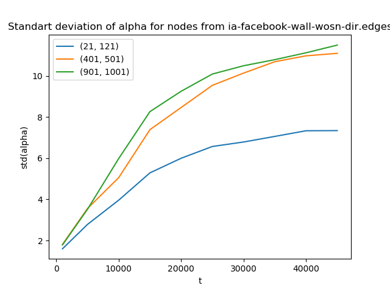
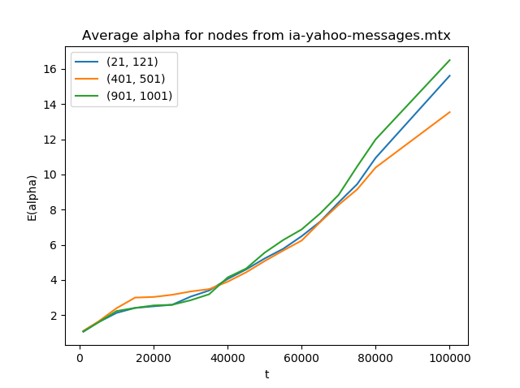
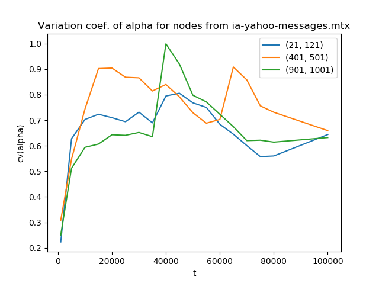
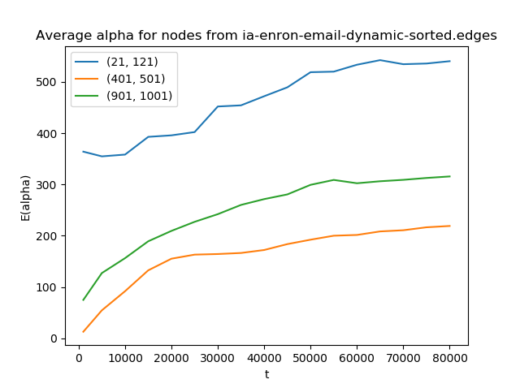
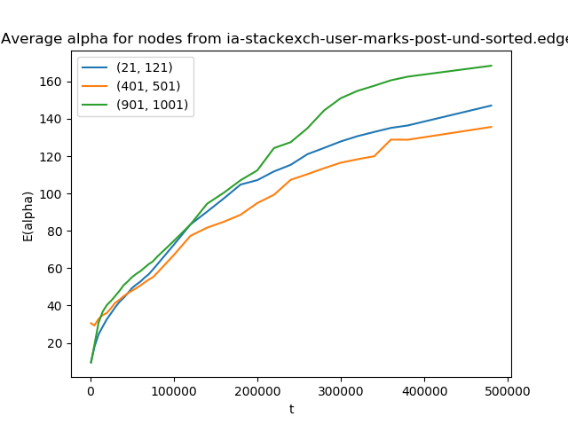
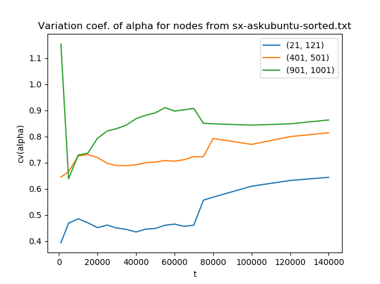
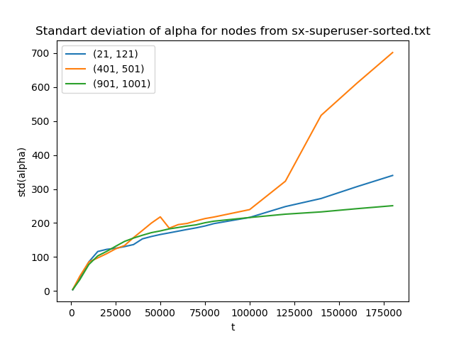

# Результаты моделирования реальных динамических сетей <!-- omit in toc -->

- [Описание задачи](#описание-задачи)
- [Статистка по сетям](#статистка-по-сетям)
- [Результаты по каждой сети](#результаты-по-каждой-сети)
  - [Facebook wall](#facebook-wall)
  - [Yahoo messages](#yahoo-messages)
  - [Enron mail](#enron-mail)
  - [HepPh citations](#hepph-citations)
  - [Stack Overflow user marks post](#stack-overflow-user-marks-post)
  - [AskUbuntu](#askubuntu)
  - [SuperUser](#superuser)

## Описание задачи
* Выбирается реальная динамическая сеть. 
* Выбираются диапазоны узлов, внутри которых будут вычисляться средние значения средней степени соседей и стандартные отклонения. 
* Моделируется динамическая сеть. На каждой итерации добавляется ребро и узлы: узел добавляется в сеть, если он принадлежит ребру, и узла с данным номером еще нет в сети. 
* Когда количество узлов достигает определенного значения, вычисляется среднее значение средних степеней соседей и стандартное отклонение.

Входные данные динамических сетей взяты из онлайн-репозиториев.

## Статистка по сетям

| Название | Суть | Ссылка | Узлы | Рёбра | std |
| -------- | ---- | ------ | ---- | ----- | --------- | 
| Facebook wall | Пользователь A оставил комментарий у пользователя Б | [Ссылка](https://networkrepository.com/ia-facebook-wall-wosn-dir.php) | 42.4K | 877K | Возрастает |
| Yahoo messages | Нет описания и источника сети | [Ссылка](https://networkrepository.com/ia-yahoo-messages.php) | 100K | 3.2M | Возрастает |
| Enron mail | Сеть писем компании Enron | [Ссылка](https://networkrepository.com/ia-enron-email-dynamic.php) | 87K | 1.1M | Возрастает |
| HepPh citations | Сеть цитирований HepPh | [Ссылка](https://networkrepository.com/ca-cit-HepPh.php) | 28.1K | 4.6M | Возрастает |
| Stack Overflow user marks posts | Двудольный граф. Сайт StackOverflow. Пользователь A добавил запись Б в желаемое.  | [Ссылка](https://networkrepository.com/ia-stackexch-user-marks-post-und.php) | 	545.2K | 1.3M | Возрастает |
| AskUbuntu | Сайт AskUbuntu. Пользователь А ответил, прокомментировал запись/комментарий пользователя Б.  | [Ссылка](https://snap.stanford.edu/data/sx-askubuntu.html) | 	159K | 964K | Возрастает |
| SuperUser | Сайт SuperUser. Пользователь А ответил, прокомментировал запись/комментарий пользователя Б.  | [Ссылка](https://snap.stanford.edu/data/sx-superuser.html) | 	194K | 1.4M | Возрастает |

## Результаты по каждой сети
Далее приведены подробные результаты для каждой реальной сети. Стоит заметить, что как и в случайных сетях t = количество узлов в сети, но между двумя добавлениями узлов может быть добавлено разное количество рёбер. С ростом сети количество добавляемых рёбер на каждый узел значительно повышается. 

- Левый график - усредненная средняя степень соседей, аналог мат. ожидания средней степени для случайных сетей. Вычислялось для группы из 30 узлов на разных итерациях.

- Центральный график - стандартное отклонение средней степени соседей.

- Правый график - коэффициент вариации (отношение стандартного отклонения к среднему)

### Facebook wall
  

### Yahoo messages
  

### Enron mail
  

### HepPh citations
  

### Stack Overflow user marks post
  

### AskUbuntu
  

### SuperUser
  

